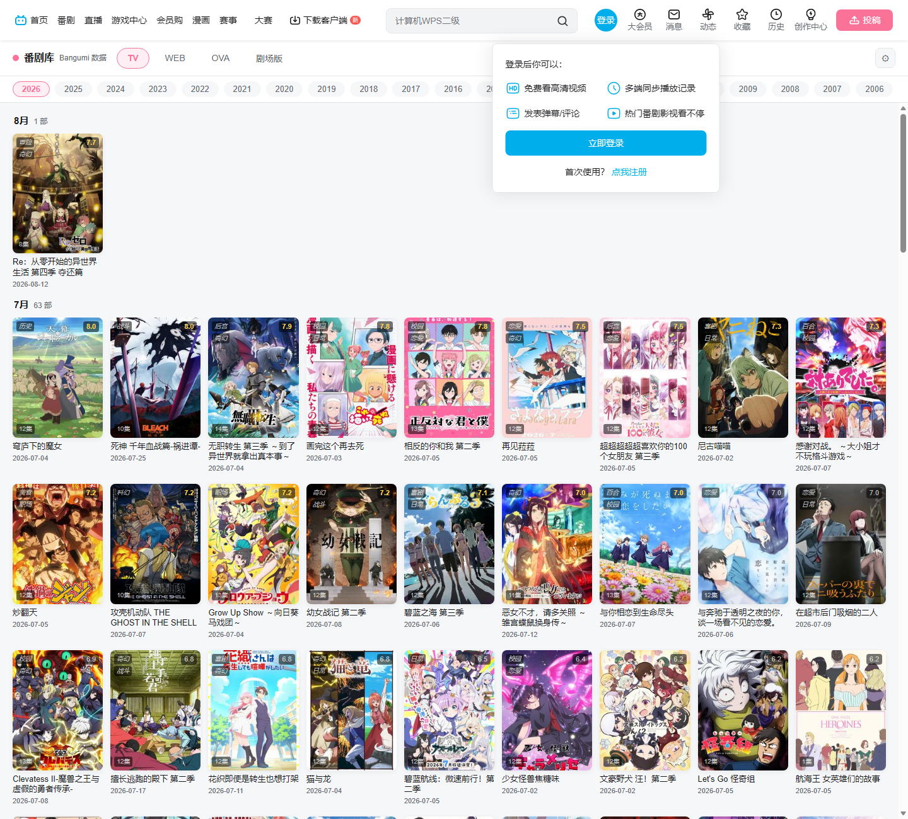
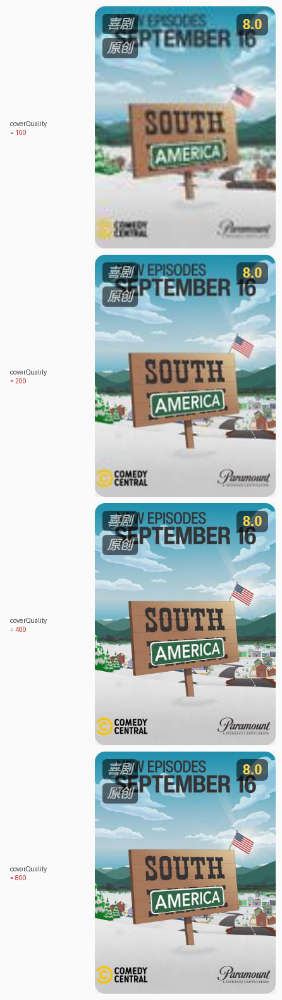
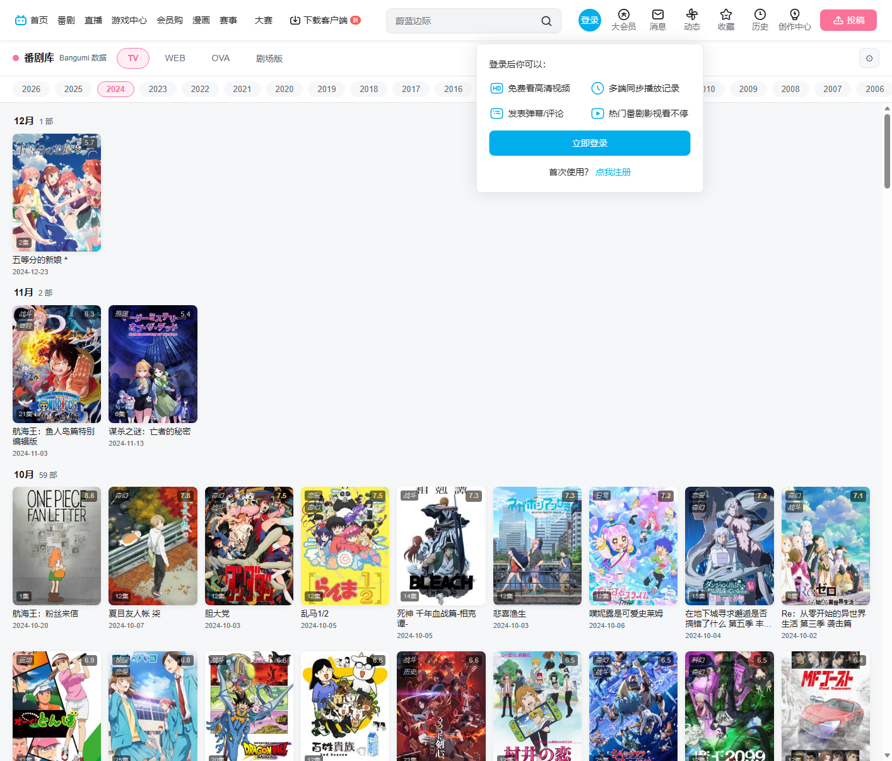
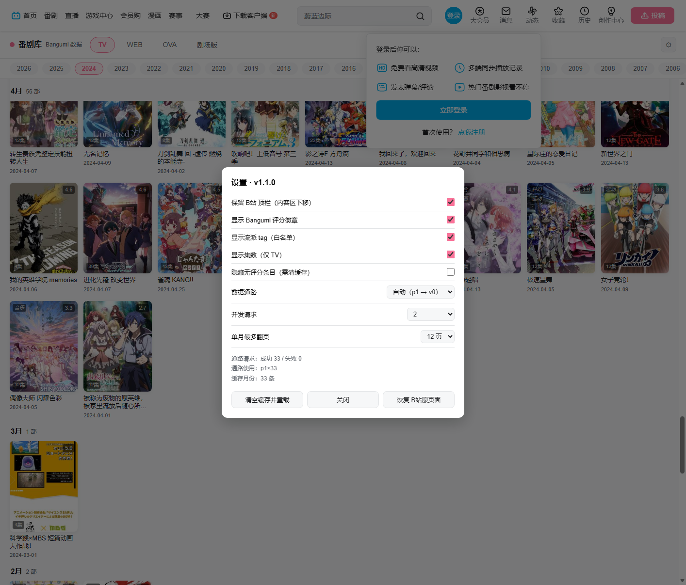

# B站番剧区 → Bangumi 番剧浏览页

一个 Tampermonkey 脚本（`bili-anime-replace.user.js`）：打开 `www.bilibili.com/anime/*` 时，把 B站 那套番剧区**整页换成自制的 Bangumi 番剧浏览页** —— 数据全部来自 [Bangumi](https://bgm.tv)，只保留最上面那排 B站 顶栏。

**➡️ [Greasy Fork 一键安装](https://greasyfork.org/zh-CN/scripts/596516-b%E7%AB%99%E7%95%AA%E5%89%A7%E5%8C%BA-bangumi-%E7%95%AA%E5%89%A7%E6%B5%8F%E8%A7%88%E9%A1%B5)** ｜ 源码与反馈：[GitHub](https://github.com/xmbl4399/bili-bgm-overlay)

> **v1.6.6**：**徽章可读度 + 年份栏紧凑化 + 默认隐藏无评分** —— ① 评分/流派 tag/集数三个徽章改用**同一套基底**：底色 `rgba(0,0,0,.54)` → `.74`、白字 70% → 95%、字重 600、字号各 **+1px**，并补描边 + 投影 + 毛玻璃（旧值在浅色封面上几乎糊成一片）；② 年份栏行内 padding `8→4`、chip 的 padding/gap/字号各降一档、圆角 `14→10`。实测 1280×720：**21 个年份 chip 从「溢出 89px、必须拖动」变成一行放得下**，条高 **40 → 30px**。对照图：[徽章](docs/badge-visibility-compare.png)（720P，上改前/下改后）· [年份栏](docs/yearbar-compact-compare.png)（局部放大 2.5×）。③ **默认隐藏无评分条目**：`hideNoScore` 默认 `false` → `true` —— E2E 实测韩剧 2026 卡片 **71 → 38（−46%）**（Bangumi 尚未开分的新剧占近一半），但每个月仍有条目、**无空月**。TV 2026（v0 原始口径，336 条）少了 **−20%（336 → 270）**，但**分月极不均匀**：1/4/7 月这些"已开分的大季度"只少 1~5%，而 **10 月 −57%（79→34）、11 月全空（2→0）、3/9 月约 −50%** —— 新番要开播之后才陆续开分，所以**临近/未来月份**受影响最大，过一阵会自己缓解。⚠️ 它是**数据层过滤（发生在写缓存之前）**，改动后要**清缓存**才生效 —— 与「封面质量」那种渲染时改写的设置不同（见 [缓存机制](#缓存机制v162-修订)）。
>
> **v1.6.5**：**默认封面质量 `r100` → `r200`** —— r100 在高分屏上发虚，r200（约 20 KB/张，79 部合计 1.3 MB）在 2× 屏上清晰度合适、体积仍只有 r400 的 29%。设置里的 6 档与「改动即刻生效」行为不变，已缓存月份也会立刻按新默认渲染。
>
> **v1.6.4**：**封面质量可在设置里调** —— 实测 `lain.bgm.tv` 的 `/r/<N>/` 是**离散档位**（`r50` / `r150` / `r300` 一律 **HTTP 400**），可用档位只有 **100 / 200 / 400 / 600 / 800**。新增 `withCoverWidth()`：封面**基准恒取 `common`，宽度在渲染时改写** ⇒ 改设置**对已缓存的月份立刻生效**（档位不烘进缓存 URL）。设置面板新增「封面质量」6 档（含原图），默认 **r100（最低，约 6 KB/张）**。79 部新番封面总体积：**r100 0.43 MB ↔ r800 12.4 MB，差 29 倍**。
>
> **v1.6.3**：**封面档位改取 `common`(r/400)** —— 两条数据通路的档位**命名不对齐**（v0 的 `medium` 是 **r800**、p1 的 `medium` 是 **r200**），原先 `medium` 优先 ⇒ 走 v0 时每张多下 **6 倍**、走 p1 又偏小；**只有 `common` 两边一致**（都 r400）。抽出 `pickCover()` 统一并加兜底。7 月新番 79 部实测：封面总体积 **18.6 MB → 5.5 MB（−70%）**。
>
> **v1.6.2**：修三处缓存缺陷 —— ① 两个缓存时效（当年 12h / 历史年 30d）**此前只存在于配置、没有任何 UI**，名义可配实际改不了，现已暴露到设置面板；② 缓存索引超过 2000 条时**只丢索引不删数据**，导致被挤出的键「数据还在、清空缓存却遍历不到」——**永久泄漏**（9 分类 × 12 月 × 20 年已约 2100 条），现改为**淘汰即真删**；③ **空结果**原按 12h/30d 缓存，会把「这时真的还没数据」钉住很久，现单独给 **30 分钟**短时效以便自愈。
>
> **v1.6.1**：顶栏与年份栏补上**横向滑动** —— 两栏的滚动条是刻意藏掉的（视觉整洁），但此前没给替代手段，桌面鼠标用户「看得见滚不动」。新增 `enableDragScroll()`：指针拖拽平移（Pointer Events + `setPointerCapture`）+ 纵向滚轮转横向 + 拖拽期间压掉平滑滚动，且拖完不会误触发分类切换。
>
> **v1.6.0**：新增 **韩剧 tab**（共 9 个分类）—— Bangumi 无该分类，走 `platform=电视剧` **AND** tag 命中 `韩剧/韩国/韩语` 的近似实现，实测命中率 **2026 年 100% / 2025 年 87%**。同时解决 **720P 适配**：9 个 tab 挤一行，顶栏尺寸全部改 `clamp()` 连续收缩 + tab 行横向滚动（绝不 wrap），并让选中 tab 自动滚入视野。
>
> **v1.5.0**：新增 **4 个真人影视分类**（`日剧 / 欧美剧 / 华语剧 / 电影`），品牌区精简为只显示 `Bangumi`。三类剧集直接用 `type=6&cat=1|2|3`；**电影无 cat**（`cat≥4` 一律 400）⇒ 走「不带 cat 拉全平台 + 前端按 `platform` 过滤」，因此修掉一个**带过滤时会漏数据的分页提前退出 bug**。
>
> **v1.4.0**：数据源改为 **`api.bgm.tv/v0` 优先** —— 该列表接口**自带全量用户投票 tag**（≤30 个）⇒ **整套「详情补拉」机制关闭**（TV 全年：14 请求 + 33% 补拉 → **4 请求、0 补拉**），题材命中率 57.3% → **74.2%**；同时 Tier3 兜底默认关。完整接口方案见 **[docs/bangumi-v0-api-guide.md](docs/bangumi-v0-api-guide.md)**（可移植到其他项目）。
>
> **v1.3.0**：① 主题**跟随 B站 自己的深/浅色开关**（不是跟随系统）；② B站 顶栏头像弹层里的**状态行**；③ tag 白名单重做成**数据驱动的二级 + 可选第三级** —— 设计方法与词表见 **[docs/tier-whitelist-design.md](docs/tier-whitelist-design.md)**（可移植到其他项目）。

## 安装

**一键安装：[Greasy Fork · B站番剧区 → Bangumi 番剧浏览页](https://greasyfork.org/zh-CN/scripts/596516-b%E7%AB%99%E7%95%AA%E5%89%A7%E5%8C%BA-bangumi-%E7%95%AA%E5%89%A7%E6%B5%8F%E8%A7%88%E9%A1%B5)**

1. 浏览器装 **Tampermonkey**（Edge / Chrome 商店均有）。
2. 装脚本任选一种：
   - 打开上面的 **Greasy Fork** 链接 → **安装此脚本**（推荐，之后能自动收到更新）；
   - 或把 `bili-anime-replace.user.js` **直接拖到浏览器窗口**里，Tampermonkey 会拦下并弹出安装页；
   - 或 Tampermonkey 面板 → **实用工具 → 从文件导入**；
   - 或 Tampermonkey 面板 → 新建脚本 → 把文件内容整段粘进去 → Ctrl+S。
3. 打开 <https://www.bilibili.com/anime/> 即可看到自制的番剧浏览页。

> **必须给 `GM_xmlhttpRequest` 权限。** Bangumi 的 `api.bgm.tv` 与 `next.bgm.tv` **都没有 CORS 响应头**，只有 Tampermonkey 的后台请求能取到数据。若脚本被装在"无 GM 权限"的环境（例如当普通 content script 注入），页面里 `fetch` 必被浏览器拦死，会显示「加载失败 + 重试」——这是环境限制，不是脚本 bug。
>
> 文件直连（`file://`）导入时若 Edge 没反应，去 `edge://extensions` 给 Tampermonkey 打开「允许访问文件 URL」。

### 卸载 / 临时关掉

| 想做什么 | 怎么做 |
|---|---|
| 临时看回 B站原页面（不卸载） | 页面顶栏 ⚙ → **恢复 B站原页面**，或 Tampermonkey 菜单 → 恢复 B站原页面（仅本次会话，刷新即回来） |
| 彻底不替换 | Tampermonkey 面板里把该脚本的开关关掉 / 删除 |

---

## 一、脚本做什么

### 效果



打开 `https://www.bilibili.com/anime/`（或 `/anime/index/`、`/anime/timeline/` 等任意子页），**B站 那套番剧区被换成这个页面 —— 只留最上面那排 B站 顶栏**（要连顶栏一起藏掉也行，设置里一键切）。

> 上图里的"登录后你可以"卡片是 **B站 自己的访客提示**（headless 未登录所以弹了），不是本脚本画的 —— 它正好演示了表头浮层浮在内容之上。

### 页面构成（1:1 对齐 PiliPlus 的 `lib/pages/bangumi_browse/`）

| 区域 | 形态 |
|---|---|
| **B站 顶栏（保留）** | 首页 / 番剧 / 直播 / 游戏中心 / 会员购 / 漫画 / 赛事 / **搜索框** / 登录 / 大会员 / 消息 / 动态 / 收藏 / 历史 / 创作中心 / 投稿 —— 原封不动留在最上面，能点能搜 |
| 顶栏（自有） | `● Bangumi` + 二级分类 tab `TV / WEB / OVA / 剧场版 / 日剧 / 欧美剧 / 华语剧 / 韩剧 / 电影`（横向可滚，胶囊选中）+ 主题按钮 `◐/☀/☾` + 设置 ⚙ |
| 年份栏 | `2026 → 2006` 横向 chip，默认当前年；**紧凑版（v1.6.6）**：1280×720 下一行放得下整 21 个 chip，条高 30px |
| 主体 | **月份倒序分组**，每组标题 `{m}月 · {N} 部`，下面是响应式网格 |
| 卡片 | 封面 3:4；**右上角评分徽章**（≥7 金色 `#FFD54F`）；**左上角流派 tag**（二级白名单，最多 2 个）；**左下角集数**（仅 TV）；标题 2 行省略。三个徽章共用一套基底（v1.6.6）：半透黑 `.74` + 白字 95% + 600 字重 + 描边/投影/毛玻璃 |

### 分类是怎么映射到 Bangumi 的（v1.6.0）

9 个 tab 分属**两种拉取形态** + **两级前端过滤**（探针脚本见 `tools/probe-*.mjs`）：

| tab | `type` | `cat` | 拉取形态 | 前端过滤 |
|---|---|---|---|---|
| TV / WEB / OVA / 剧场版 | 2 | 1 / 5 / 2 / 3 | `type+cat+year+month` | — |
| 日剧 / 欧美剧 / 华语剧 | 6 | 1 / 2 / 3 | `type+cat+year+month` | — |
| **电影** | 6 | **（不传）** | `type+year+month` 拉全平台 | `platform === 电影` |
| **韩剧** | 6 | **（不传）** | `type+year+month` 拉全平台 | `platform === 电视剧` **且** tag 池命中 `韩剧/韩国/韩语` |

四个关键实测事实：

1. **`type=6` 的 `cat≥4` 一律 HTTP 400**（cat 5…14 逐个试过）⇒「电影」和「韩剧」在 Bangumi 里**都不是 cat**，只能不带 `cat` 拉全量再前端过滤。好在实测**不带 `cat` 时 `year+month` 同样生效**（返回条目的 `date` 全落在所查月），所以月份分组照常工作。
2. **列表项自带 `platform` 字段**，`type=6` 的 `platform` 全集**只有这 8 种**：
   `日剧 / 欧美剧 / 华语剧 / 电影 / 演出 / 其他 / 电视剧 / 综艺`
3. **Bangumi 没有「韩剧」分类** —— `鱿鱼游戏`、`黑暗荣耀` 这类韩剧的 `platform` 都是 **`电视剧`**，这是个**混合容器**（韩剧 + 部分美剧/台剧等混放）。唯一可用信号是 tag 里的「韩国」⇒ 韩剧 tab 是 `platform=电视剧` **AND** tag 命中 `韩剧|韩国|韩语` 的**近似**实现。
4. `演出 / 综艺 / 其他` 不是影视剧，未纳入。

#### 韩剧 tab 的实测成色（tools/probe-kdrama-film.mjs / probe-kdrama-miss.mjs）

| 年 | `platform=电视剧` | tag 命中韩 | 命中率 |
|---|---|---|---|
| 2026 | 14 | 14 | **100%** |
| 2025 | 78 | 68 | **87%** |

2025 年那 10 条漏检逐条人眼核过，**没有一条是「韩国生产却漏」**：

- 泰国 BL 剧 2 条（`泰国/泰剧`）—— 本来也不该进韩剧 tab ✅ 漏得对
- 国产剧 1 条、斯巴达克斯（tag 池空）、超英《战神金鸿》（`特摄`）、日本《大叔的爱》（tag 池空）、韩国 BL《吾岸》（只有 `同性/BL/小说改`）—— 确实算漏，但**无解**
- **`韩语` 写法 1 条**（清潭国际高中 第二季）—— 唯一**可补**的词，已收进过滤正则

> 另一个好消息：`platform=电视剧` 里**一条美剧都没有**（美剧有自己的 `platform`）⇒ 没有「非韩剧混进来」的主要来源。
> **代价须知**：`tagPool` 在 **p1 通路**下只有 `meta_tags`（拿不到用户投票词），命中会大减；v0 通路下命中 `tags ∪ meta_tags`，才是上表的效果。

### 过滤 + 分页的一个坑（v1.5.0 修）

「电影」是**带前端过滤**的模式（约 1/6 的全量条目是电影），所以**整页 100 条可能一条都不匹配**。此时若按「过滤后剩余条数为 0」判断停止翻页，会**在第一个『恰好没有电影』的页就提前 break，漏掉后面所有电影**。

修法：v0 分页函数额外返回 `rawLen`（该页**过滤前**的原始长度），停止条件改看 `rawLen === 0`；p1 分支则仅在**无过滤**时保留原有的提前退出。E2E 实测电影 tab 渲染出的条目 **`platform` 100% 为「电影」**，且连续多页（12→11→10→8→7→6 月）都能正确取到。


### 保留 B站 顶栏（v1.1.0 起，默认开）

内容区排在 B站 表头**下面**，表头照常工作。设置面板里可一键关掉，关掉就退回"整页铺满、连表头一起藏"。实现上有两个非显然的点：

| 坑 | 现象 | 解法 |
|---|---|---|
| **表头是白字** | 表头 `color` 是 `rgb(255,255,255)` + 顶部深色渐变 —— 那是给番剧区那张**大横幅**打的底。藏掉 `#app`（横幅在里面）后，白字压白底 = **完全看不见** | 不自己覆盖配色（会连带毁掉大会员图标、投稿按钮的自身配色），而是给 `.bili-header__bar` 补上 B站 自己的 **`slide-down`** 类 —— 那是它滚动后的"实底"皮肤：背景转白、渐变消失、文字转深色，高度仍是 64 |
| **表头自成一"层"** | `.bili-header__bar` 是 `position:fixed; z-index:1002`，**它内部的下拉浮层也只能待在 1002 这一层**。内容区若用超高 z-index 压上去，表头的下拉（消息/动态/头像卡）就会被整片盖住 | 保留表头时内容区取 `--bgm-z = 表头 z-index − 1`（实测 1001）；自有设置面板/toast 仍用 21 亿，压在表头之上 |
| **表头是异步渲染的** | 服务端 HTML 里只有 `<div id="biliMainHeader" style="height:56px">` 占位，真正的 `.bili-header__bar`（h64）由 B站 的异步 UMD 脚本挂上去 | 量到真值前先用兜底 64px，起来后立刻校正（100ms×20 次 + 常驻 1.2s 兜底）——否则内容区会先按 0 排布再往下跳 |

> 表头保留时，**自有搜索框会自动收起** —— B站 那个就在正上方、行为完全一样（都跳 B站 搜索），两个叠着太多余。

### 主题：跟随 **B站 自己的** 深/浅色（v1.3.0）

B站 新版有个「主题：浅色/深色」开关（在头像弹层里）。本页面**跟随它**，而不是跟随操作系统。实测的机制如下 —— 这也是最容易猜错的一处：

| 猜想 | 实测结果 |
|---|---|
| `<html>` 上有 `class="dark"` | ❌ 页面 `<html>` 上**没有任何**主题标记 |
| `data-theme="dark"` / `data-dark` / `color-scheme` | ❌ 逐个施加到页面上，背景色**纹丝不动** |
| `prefers-color-scheme` | ❌ 不参与（系统深色 + B站 浅色时，B站 仍是浅色） |
| **`<link id="__css-map__" href="…/bili-theme/light.css">`** | ✅ **这才是真开关**：切深色 = 把 href 换成同目录的 `dark.css` |

`dark.css` 只是把 `:root` 的调色板（`--Ga0/--Ga1/--Wh0/--Lb5…`）整包换成暗色值，`map.css` 再把它们映射成语义变量（`--bg1/--bg2/--text1/--text2/--graph_bg_thick/--brand_pink`）。于是自适应分两层：

1. **CSS 桥接（零 JS）** —— 本页面的调色板**直接引用 B站 语义变量**：
   `--bg: var(--bg2, #f6f7f8)`、`--card: var(--bg1, #fff)`、`--line: var(--graph_bg_thick, #e3e5e7)`……
   B站 切主题时这些变量自己在变 ⇒ 本页面跟着变，不需要我们做任何事。
2. **JS 判定** —— 只在三处需要知道"当前是不是深色"：状态文字、`color-scheme`（滚动条/下拉控件）、以及 B站 变量缺失时的兜底调色板。判定按可靠性排序：**官方 link → 背景系语义变量亮度 → 通用 dark 标记 → 系统偏好**（*注意别拿 `--text1` 判断亮度，它在浅色下本来就是深色，会正好判反*）。监听用 `MutationObserver`（盯 `head` 的 href 变化）+ `matchMedia` + 1.5s 低频兜底。

设置面板里可切「跟随 B站（默认）/ 强制浅色 / 强制深色」；**强制模式会加 `.bgm-forced` 绕开桥接**（否则在浅色 B站 上"强制深色"会被 B站 的浅色变量顶掉，等于没强制）。顶栏那个 `◐/☀/☾` 按钮点一下循环切换。

同时把结果写到 `<html data-bgm-theme="dark|light">`，外部工具只看 DOM 即可，不必读本脚本内部状态。

### B站 顶栏头像弹层里的状态行（v1.3.0）

点 B站 右上角头像弹出的面板里，本来有一项「主题： 浅色」。我们**用和 B站 完全相同的 class 名**（`.single-link-item` / `.link-title` / `.link-icon`）在同容器插一条状态行：

```
◐ Bangumi： 已接管 · 浅色        ›
```

- 位置：紧跟在 B站 自己那条「主题：」之后（找不到就排最前）
- **一行自定义 CSS 都不用写**：配色、hover、深浅色全部继承 B站 的样式
- 鼠标悬停显示详情（版本 / 数据通路与本次使用情况 / 请求成败 / 缓存月份数 / 当前主题）
- 点它 = 打开设置面板
- 该面板**只有登录后才渲染**，所以插入靠 `MutationObserver` 等它出现，并且**认 id 幂等**（Vue 会复用节点，重复 tick 不会叠加）

### tag 提取：两个字段并集 + 两级白名单（v1.4.0）

Bangumi 的 tag 是**受控小词表**（2023–2026 四年 937 条样本，去重后**只有 53 个词**），所以白名单只能从真实数据里筛，不能凭直觉写。

**v0 列表项给两个 tag 字段 —— 直接并集、一视同仁**：

```
tags      [{name,count} × ≤30]   按票数降序  ┐
                                             ├→ 去重 → 候选词池 → 过白名单取前 2
meta_tags ["TV","日本","原创" × ≤10]  摘要   ┘
```

`meta_tags` 是服务端**精挑摘要**（不是票数 TopN），为了塞进平台/地区会**把题材词挤掉**；`tags` 才是用户投票全量。**只吃任何一个都会漏** —— 例：梅比乌斯之尘的 `meta_tags` 只给 `原创`，而 `科幻(54)` `战斗(29)` 全在 `tags` 里。

| 层 | 词数 | 作用 |
|---|---|---|
| **Tier1 题材** | 27 | 优先显示，同层内按票数先后 |
| **Tier2 来源/受众** | 12 | 一级不够 2 个时补位 |
| **Tier3 平台/地区** | 10 | 兜底，**默认关** |

**为什么 Tier3 默认关**（2026 全四类 744 条实测）：

| 类别 | 条数 | 占比 |
|---|---|---|
| 有 tag | 646 | **86.8%** |
| 空卡 · 两字段都是空数组 | 13 | 1.7% ← 无解 |
| 空卡 · 词池里只有平台/地区词 | 82 | 11.0% ← 开 Tier3 可填，但填进去是 `WEB / 剧场版 / 中国 / 日本` |
| 空卡 · 词池里有白名单外词 | **3** | 0.4% ← 唯一"可补词"候选，而这 3 条的未命中词是 `Albert.Birney`、`三浦莉希`、`山下清悟` —— **全是人名** |

⇒ **补词收益为零**（加人名只会污染词表），而 11% 的兜底词比空着更没信息量。**宁缺毋滥：Tier3 关。**
分类型覆盖率（Tier3 关）：TV 92.5% / OVA 100% / WEB 83.2% / 剧场版 79.4%；开 Tier3 = 97.8%。
那 1.7% "池空"的条目是 `SEALOOK`、`Thomas & Friends`、`吃豆人：零食时间` 这类**欧美网络动画 / 短片** —— Bangumi 上没人投中文 tag，换通路换词表都救不了。

完整方法、词表、频次、陷阱清单见 **[docs/tier-whitelist-design.md](docs/tier-whitelist-design.md)**，接口调用方案见 **[docs/bangumi-v0-api-guide.md](docs/bangumi-v0-api-guide.md)**。

### 720P 屏幕适配（v1.6.0）

分类涨到 **9 个**后，顶栏在 720P（1280×720，实际视口约 1265px）下必须一分不浪费。做法：

| 手段 | 说明 |
|---|---|
| 尺寸全走 `clamp()` | 顶栏高、tab 内边距、字号、图标尺寸、搜索框宽都随视口**连续**收缩，不靠断点跳变 |
| tab 行**允许压缩 + 横向滚动** | `.bgm-modes` 是 `flex:1 1 auto; min-width:0`，`overflow-x:auto` —— **绝不 wrap**（分类是主交互，换行会顶掉内容区） |
| 选中 tab 自动滚入视野 | `syncModeButtons()` 里对 `.on` 调 `scrollIntoView({inline:'center'})`，否则窄屏切换会「选中了但看不见」 |
| 品牌文字在窄屏让位 | `@media (max-width:860px)` 隐藏 `.bgm-brand-txt`，**圆点保留**（信息不丢） |

实测（CDP 真实改视口，断言「tab 行数 == 1」与「顶栏不纵向溢出」）：

| 视口 | tab 行数 | tab 行宽 / 容器 | 顶栏高 | 品牌文字 |
|---|---|---|---|---|
| 1280×720（720P） | 1 ✅ | 491 / 1062（余量充足） | 47px | 显示 |
| 1366×768 | 1 ✅ | 514 / 1145 | 49px | 显示 |
| 1024×768 | 1 ✅ | 420 / 832 | 49px | 显示 |
| 800×600 | 1 ✅ | 390 / 696 | 47px | 隐藏（圆点保留） |

### 顶栏 / 年份栏的横向滑动（v1.6.1）

**滚动条是刻意藏掉的**（`scrollbar-width:none` + `::-webkit-scrollbar`），所以两栏必须另外给"能拖"的手段，
否则桌面鼠标用户既看不到滚动条、纵向滚轮又不会横滚 ⇒ **"看得见滚不动"**（v1.6.0 的真实短板，实测
800×600 下按住 `.bgm-modes` 拖 120px，`scrollLeft` 纹丝不动）。

`enableDragScroll(box)` 三件事一起做：

| 能力 | 实现 |
|---|---|
| **指针拖拽平移** | Pointer Events + `setPointerCapture`（指针移出元素也不丢手势）；位移超 4px 才算"拖" |
| **纵向滚轮 → 横向滚动** | 鼠标最自然的动作；`deltaMode` 为行/页时折算成像素，并按 `scrollWidth` 夹取，到边不吞事件（页面还能正常滚） |
| **拖拽期间压掉 `scroll-behavior:smooth`** | 否则每次改 `scrollLeft` 都被平滑动画拖后腿，手感发飘 |

刻意**不做**：不用 `preventDefault` 拦 `click` —— 改为在 capture 阶段用 `moved` 阈值把"拖完补发的那一次 click"吃掉，
避免"拖一下"误切分类。触摸设备（`pointerType === 'touch'`）**完全不拦**，原生触摸滚动 + 惯性更好。

实测（`tools/probe-dragscroll.mjs`，420×800 两栏都真溢出）：

| 测试 | 结果 |
|---|---|
| 顶栏指针拖拽 | `scrollLeft 0 → 101` ✅ |
| 顶栏滚轮横向 | `0 → 101` ✅ |
| 年份栏指针拖拽 | `0 → 160` ✅ |
| 拖拽后不误切 tab | 分类保持 `tv` ✅ |

> 注：800×600 下顶栏 `scrollWidth == clientWidth`（**放得下**），此时拖拽被 `enableDragScroll` 主动短路 —— 这是正确行为，不是失效。

### 交互

| 操作 | 结果 |
|---|---|
| 点卡片 / 标题 | 打开 **B站搜索结果页** `search.bilibili.com/all?keyword=<name_cn 优先>…` |
| 卡片上右键 | 复制该关键词 |
| 顶栏搜索框回车 | 直接跳 B站搜索（保留 B站 表头时用 B站 自己那个搜索框） |
| 悬停封面 | 浮出完整信息：中文名 / Bangumi 评分 / 排名 / 放送日期 |
| ⚙ | 设置面板：**保留 B站 顶栏**、评分/tag/集数开关、**Tier3 兜底开关（默认关）**、**主题（跟随/强制）**、**详情补拉（默认关）**、**隐藏无评分（默认开）**、**数据通路（v0 优先）**、并发、单月翻页上限、清缓存、恢复 B站 原页面 |
| Tampermonkey 菜单 | 恢复 B站 原页面（本次会话）、清空 Bangumi 缓存 |

### 加载策略

- **逐月流式 + 懒加载**：进入视口前 400px 才拉该月，其余月份只占位 —— 首屏只发 1–2 个请求。
- **缓存**：命中缓存秒出（当年 12h、历史年份 30d，可在设置面板改）。
- **空月份直接隐藏**：TV 番集中在 1/4/7/10 月首播，5/6/8/9 月常年 0 部，留着会白占几屏。
- **分类/年份切换**用 `loadToken` 作废旧请求，避免串台。

### ★ 封面质量（v1.6.4）—— 比换接口值钱得多

**接口响应总额 592 KB，而 79 张封面在 r400 下就有 4.2 MB（r800 则 12.4 MB）** ⇒ 封面始终是接口响应的数倍到数十倍，优化它的收益远大于换数据通路。

`lain.bgm.tv` 的 `/r/<N>/` 是**离散档位**，不是任意宽度：

| | |
|---|---|
| **可用档位** | **100 / 200 / 400 / 600 / 800** |
| **不可用** | `r50` / `r150` / `r300` → **HTTP 400** |

卡片列宽 `minmax(132px,1fr)`（窄屏 104px）⇒ 1× DPR 需约 132px、2× 约 264px、3× 约 396px。

| 档位 | 单张实测 | 79 部合计 | 清晰度（132px 卡片） |
|---|---|---|---|
| r100 | 6.2 KB | **0.43 MB** | 1× 屏够用；2× 屏会糊 |
| **r200**（默认） | 20.5 KB | 1.3 MB | 2× 屏合适（默认） |
| **r400** | 71.0 KB | 4.2 MB | 3× 屏清晰（原来的行为） |
| r600 | 147.7 KB | — | 冗余 |
| r800 | 241.7 KB | 12.4 MB | 明显冗余 |
| 原图 | 863.5 KB | — | 慎选 |

**实现要点**：封面**基准 URL 恒取 `common`**，宽度在**渲染时**用 `withCoverWidth()` 改写 —— 所以改设置**对已缓存的月份立刻生效**（档位不烘进缓存 URL，不必清缓存）。

同一张卡在四个档位下的实际渲染（2× DPR 高分屏模拟，`tools/shot-cover-quality.mjs` 生成）：



r100 明显发虚、r400 起海报小字清晰可读 ⇒ 默认取 `r200`（2× 屏合适、体积仅为 r400 的 29%），1× 屏可下调 `r100`，高分屏建议 `r400`。

> ⚠️ **两条通路的档位命名不对齐**，所以不能用各档字段直接取：
> `v0: large=原图 | common=r400 | medium=r800 | small=r200 | grid=r100`
> `p1: large=原图 | common=r400 | medium=r200 | small=r100 | grid=r100x100（方形裁剪）`
> 只有 `common` 两边都指向 r400。另：旧文档曾把 p1 的 `grid` 记成「原图」，实为 **100×100 方形裁剪** —— 误记源于判档正则 `\/r\/(\d+)\//` 匹配不上 `r/100x100`（`\d+` 后面接的是 `x` 不是 `/`），落进了「无 `r` 段 = 原图」分支。

### 缓存机制（v1.6.2 修订）

**存储**：`GM_getValue`/`GM_setValue` 优先，无 GM 环境降级 `localStorage`，键统一加 `${NS}:` 前缀、值走 JSON。

**粒度**：按 **`m:{分类}:{年}:{月}`** 逐月独立缓存 —— 不是整页一把抓，所以切分类/切年时命中率很高。

| 内容 | 时效 | 配置项（设置面板可改） |
|---|---|---|
| 当年数据 | **12 小时** | 缓存时效 · 当年（1h / 6h / 12h / 24h / 3d / 7d） |
| 历史年数据 | **30 天** | 缓存时效 · 历史年（1d / 7d / 30d / 90d / 1年） |
| **空结果** | **30 分钟** | 固定（不可调） |
| 详情补拉 `d:{id}` | 30 天 | 跟随"历史年" |

「当年 / 历史年」是**动态判定**的：`ttlOf(year)` 每次比较时现算 `new Date().getFullYear()`，所以跨年零时后旧年份自动从 12h 降级为 30d，无需人工干预。

**★ 哪些设置「改完要清缓存」**（两类，别混）：

| 设置 | 是否要清缓存 | 原因 |
|---|---|---|
| **隐藏无评分**（v1.6.6 起默认开） | **要** | 过滤发生在 `fetchMonthVia()` 的 `push()` 里，即**写缓存之前** ⇒ 缓存里存的就是过滤后的结果 |
| 封面质量 | 不要 | 缓存存的是恒为 `common`(r400) 的**基准 URL**，档位在**渲染时**用 `withCoverWidth()` 改写 |
| 数据通路 / 并发 / 单月翻页 | 不要 | 只影响**下一次请求**怎么发 |

**读取**：`readCache()` 命中即秒出、完全不碰网络；未命中才进 `loadMonth()` 的通路轮询（v0 → p1，失败的通路冷却 60s）。

**★ 空结果为什么单独给 30 分钟**：`writeCache()` 对 0 条也照写。若沿用 12h/30d，会把「这时真的还没数据」（月初新番未录入、某月确实空）钉住很久，期间**没有任何自愈机会**。30 分钟后自然过期重试，代价只是极少数空月会多一次请求。

**★ 索引与淘汰**：所有写过的键登记在 `cacheKeys` 数组里，供「清空缓存」遍历删除，上限 **2000 条**。
溢出时**必须连同数据一起删掉**被挤出的键 —— 只做 `slice(-2000)` 会让那些键「数据还在、索引没了」，**「清空缓存」永远删不到它们（永久泄漏）**。
本项目 9 分类 × 12 月 × 约 20 年 ≈ 2100+ 条，已经贴着上限，因此这是个真实会触发的问题。

**清理入口**：设置面板 **「清空缓存并重载」**，或 Tampermonkey 菜单命令。

---

## 二、数据通路（这节是全部坑的所在，务必看）

选数据源的过程比写页面难得多。**v1.4.0 的结论是「v0 优先」**，这一节同时记下走过的弯路。

> ⚠️ **本节推翻 v1.3.0 之前的两条结论**（都是"只测了一个端点就下结论"造成的）：
> ① 「v0 带 query 参数全站 502」——**已恢复**，实测 `HTTP 200 / 3.4~8.8s`，裸请求即可（不校验 UA）；
> ② 「列表接口拿不到内容 tag，必须逐条拉详情」——**只对 p1 成立**。v0 的列表项**自带全量 `tags`**。

### ① `api.bgm.tv/v0/subjects` —— 主力通路（v1.4.0 起）

```
GET https://api.bgm.tv/v0/subjects?type=2&cat=1&year=2026&month=1&limit=100&offset=0
```

列表项**同时**给两个 tag 字段，这正是能拿到内容词的关键：

| 字段 | 是什么 | 形态 |
|---|---|---|
| `tags` | **用户投票的全量词** | ≤30 个 `{name,count,total_count}`，按票数降序；`count` = 该条目上这个词的票数 |
| `meta_tags` | **服务端结构化摘要** | 平台 / 地区 / 来源 / 偶尔一个题材词；⚠️ **带重复，必须 `new Set()` 去重** |

其它实测边界：

| 项 | 结论 |
|---|---|
| `limit` | **≤ 100**（传 200 → `HTTP 400`） |
| `offset` / `total` | `offset` 有效；`total` 是**总条数**（不是页数） |
| UA / CORS | 不校验 UA；**没有 CORS 响应头** ⇒ 仍必须走 `GM_xmlhttpRequest` |
| 体积 / 耗时 | 112 KB / 3.4~8.8 s（24 条）；但 TV 全年 334 条只要 **4 个请求**（p1 要 14 个 + 逐条补拉） |
| 稳定性 | 连续 8 次请求 8/8 成功 |

> 历史插曲：2026-09-19 白天这套端点还全线 502（`/v0/subjects`、`/v0/episodes` 都挂，只有不带参数的详情 / 日历正常，
> 所有社区镜像同源回源失败，`api.bgm.icu` 只是个 "Coming Soon" 占位页）——所以当时只好选了 p1。
> 同日晚间再测已完全恢复。**教训：别用一个端点推断全局，也别把"当时挂了"写死成"这接口不行"。**

### ② `next.bgm.tv/p1/subjects` —— 降级通路

```
GET https://next.bgm.tv/p1/subjects?type=2&cat=1&year=2024&month=7&page=1
```

- **分页参数是 `page`**（`limit` / `offset` / `perPage` / `pageSize` 传了全被忽略）；每页固定 **24** 条，返回的 `total` 是**总页数**
- 不校验 UA / Origin，同样**没有 CORS 响应头** → 必须走 `GM_xmlhttpRequest`
- ⚠️ **列表项只有 `metaTags`（驼峰），没有 `tags`** —— 内容词天生缺失，这是它降为备胎的唯一原因

| p1 字段 | 说明 | 映射到 |
|---|---|---|
| `id` / `name` / `nameCN` | 条目 id、原名、中文名 | 同名字段 |
| `info` | `"12话 / 2024年7月13日 / 北村翔太郎 / …"` | 正则解析出**话数**与**放送日期** |
| `metaTags` | `["校园","TV","恋爱","日本","小说改"]` | 候选词池（没有内容词时也就没得筛） |
| `rating.score` / `.rank` / `.total` | 评分 / 排名 / 评分人数 | 评分徽章与悬停信息 |
| `images.common`（经 `pickCover()`：common → medium → large → small） | 封面 | 卡片封面，两条通路统一以 **r/400** 为基准；**实际宽度在渲染时按「封面质量」改写**（`withCoverWidth()`，默认 r200，见 [§8](docs/bangumi-list-api-facts.md)） |

### ③ 图床 `lain.bgm.tv` 无防盗链

`/r/400/pic/cover/…`、`/r/200/…`、原图都直接 200，带 `Referer: bilibili.com` 也 200 —— 不需要图片代理。卡片仍然加了 `referrerpolicy="no-referrer"` 兜底。

### ④ 脚本的应对：v0 优先 + 零补拉

**v0 优先，p1 兜底**，通路失败自动冷却 60s 换下一个；设置面板可强制指定通路。

由于 v0 列表项已经带全量 `tags`，**整套「详情补拉」机制默认关闭**（`cfg.tagDetail = 'off'`）——
实测详情接口返回的 `tags` 与 v0 列表的 `tags` **逐字节一致**，补拉是纯冗余请求；
而且**两个字段都空的条目，详情也是空的**，补拉救不了任何一张空卡。代码保留，只在 v0 全部挂掉、被迫落 p1 时手动开回来。

> 升级到 v1.4.0 会**自动迁移老配置**：你之前若调过「Tag 补拉 / Tier3 兜底 / 数据通路」，
> 这三项会被重置为新默认（关 / 关 / 自动），否则老配置会一直压着新行为不放。迁移只跑一次，之后你手动改的不会被重置。

顺带纠正两个容易搞错的 B站接口事实（写在这里省得再踩）：`api.bilibili.com/pgc/*` 系列对 `Origin: www.bilibili.com` **放行 CORS**（同域，普通 fetch 可用）；但它的番剧索引 `pgc/season/index/result` **只认 `season_month`（1/4/7/10），`year` 参数不生效** —— 所以它做不了"按年份浏览"，这也是最后没选它当数据源的原因。

---

## 三、已验证结果（2026-09-19）

全部在**真实 `www.bilibili.com/anime/` 页面**上跑通（无头 Edge + 临时 MV3 扩展注入，扩展里实现了 `GM_xmlhttpRequest` 的真背景页语义，见 `tools/e2e-anime.mjs`）。

**首屏（TV / 2026）**

| 指标 | 结果 |
|---|---|
| 接管生效 `html.bgm-takeover` | ✅ |
| 自制容器 `#bgm-anime-root` | ✅ |
| 分类 tab | `TV \| WEB \| OVA \| 剧场版 \| 日剧 \| 欧美剧 \| 华语剧 \| 电影` ✅ |
| 年份 chip | `2026 … 2006` ✅ |
| 月份分组（当年） | `8月1部 / 7月63部 / 6月1部 / 5月2部 / 4月64部 / 3月2部 / 2月2部 / 1月`（**9月 0 部已自动隐藏**）✅ |
| 卡片数 | 135 ✅ |
| 评分徽章 | `7.7 / 8.0 / 8.0 / 7.9 / 7.8 / 7.8 / 7.5 / 7.5 …`（真实 Bangumi 评分）✅ |
| 流派 tag | `冒险 / 奇幻 / 历史 / 战斗 / 后宫 / 校园 / 恋爱` ✅ |
| 集数徽章 | `8集 / 12集 / 10集 / 14集 / 13集` ✅ |
| 封面 | 全部 `lain.bgm.tv` ✅ |
| 卡片链接 | `search.bilibili.com/all?keyword=…` ✅ |

**点击交互（CDP 派发真实鼠标事件）**

| 操作 | 结果 |
|---|---|
| 点「剧场版」tab | 切换成功，打出 2026 剧场版列表（20 张） |
| 点年份「2024」 | 切换成功 |
| 回 TV + 2024 | **116 张卡片**：`12月1部 / 11月2部 / 10月59部 / 9月2部 / 8月2部 / 7月50部` ✅ |
| 剧场版 + 2024 | 35 张：`雄狮少年2`、`指环王：洛汗之战`、`剧场版 进击的巨人 完结篇` ✅ |
| 滚动触发懒加载 | ✅ 卡片 **116 → 225**，11 个月份全部加载（`6月 0 部` 已隐藏） |
| 卡片封面图 | **225 张：ok 214~223 / broken 0 / pending 2~11**（pending 是懒加载、尚未进视口的）✅ |
| 打开设置面板 | ✅ `panelVisible: true`，`panelBg: rgb(255,255,255)`（不透明），统计块正常渲染 |
| 浮层自检（第 8 步） | ✅ 带 `data-bgm-float` 的探针 `display: block`（未被 hide 规则误伤）；无标记探针 `display: none`（hide 规则本身生效）；`--card` 可解析为 `#fff` |
| 保留 B站 顶栏（第 9 步） | ✅ `#biliMainHeader` `display:block`；bar 类名含 `slide-down`、底色 `rgb(255,255,255)`、无渐变、文字 `rgb(24,25,28)`；`headerBottom=64` 且 `rootTop=64`（`noOverlap: true`）；`--bgm-top=64px`、`--bgm-z=1001`（表头 1002）；自有搜索框已收起 |
| B站 表头下拉层叠（第 9 步） | ✅ 真实 hover 一个有下拉的表头项 → 浮层可见、范围 `50..306`（**伸到表头下方 242px**），证明它确实浮在内容区之上、没被 `z-index:1001` 的容器盖住 |
| 关掉保留顶栏（第 10 步） | ✅ 取消勾选后 `#biliMainHeader display:none`、`rootTop=0`、`--bgm-z` 回 21 亿、自有搜索框回来；勾回来又恢复 `rootTop=64`（**可逆**） |
| 页面 JS 错误 | ✅ 来自**本脚本 0 条**（见下方关于"假绿"的说明） |

> ⚠️ **上一版这里写着"JS 错误 0 条"，那是个假绿。** 当时的验证脚本读的是 `window.__bgmErrors`，而**这个变量脚本里从来没定义过** —— `undefined \|\| []` 于是一直打印 `[]`，等于什么都没验。
> 现在改成收 **CDP 原生事件**（`Runtime.exceptionThrown` + `Log.entryAdded`）：本轮实测未捕获异常 4~7 条，**全部是 B站 自家采集 SDK 的 `Error: COLS: response timeout`**，归到本脚本的 **0 条**；`console.error` / 网络错误 0 条。
> 顺带修了同一类问题的另一处：`window.__BGM_ANIME__` 之前只写在油猴沙箱的 `window` 上，**F12 控制台和 CDP 都读不到**（那和页面 `window` 不是同一个对象）。现已加 `@grant unsafeWindow` 真正挂到页面上，"控制台可调试"这才成立。

> 验证时靠截图抓到过一个真实 bug：隐藏 B站页面的 CSS 写的是 `body > *:not(#bgm-anime-root)`，把我自己挂在 body 下的**设置面板和 toast 一起隐藏了**（DOM 存在、点击有效、但看不见）。已改为排除 `[data-bgm-float]` 浮层标记。
>
> 第二次截图又抓到同源的另一个 bug：主题变量（`--card` / `--text` / `--line` …）原本只声明在 `#bgm-anime-root` 上，而设置面板和 toast 是挂在 `document.body` 下的**浮动层**（在 root 之外）⇒ 面板内的 `var(--card)` 解析失败，**背景变成完全透明**，底下的番剧封面直接透过面板显示出来（DOM 和点击都正常，纯视觉缺陷）。已把变量上移到 `html.bgm-takeover`，浮动层靠继承取到变量。
>
> 顺带修掉一个更隐蔽的：复制回退路径的临时 `<textarea>` 也挂在 body 下，会被 `hideCss()` 设成 `display:none !important`，而**隐藏的 textarea 无法 `select()`** ⇒ 在非安全上下文里右键复制会静默失败。已加 `data-bgm-float` 标记。
>
> 这三个是**同一族**：全都是"挂在共同祖先之外的东西，拿不到只声明在容器里的规则/变量/层叠顺序"。规律记一下 —— **凡是会"逃出容器"的浮层（设置面板、toast、临时节点），它需要的 CSS 变量、z-index 层级、以及"别把我藏起来"的排除标记，都必须定义在两边的公共祖先上。**

保留 B站 表头后，B站 自己的下拉浮层正常浮在我的内容之上（下图里是它的访客登录提示卡，压在我的月份网格上）：



修复后的设置面板（不透明、浮层未被误伤、第一行就是「保留 B站 顶栏」）：



> 为避免这类"只有肉眼能发现"的缺陷再次溜过，`tools/e2e-anime-cdp.mjs` 现在会自动跑第 8 步**浮层可见性自检**：插入一个带 `data-bgm-float` 的探针（应 `display: block`）+ 一个无标记探针（应 `display: none`），并断言面板 `backgroundColor` 不是全透明、`--card` 能解析出值。以后 UI 改动跑一遍就知道有没有踩同一类坑。
>
> 第 9 / 10 步则是**保留 B站 顶栏**的专项断言（几何 / 皮肤 / 层叠 / 可逆），见上表。

### v1.4.0 专项验证（v0 通路 / 零补拉 / 配置迁移）

`node tools/e2e-anime-cdp.mjs`（全量回归）+ `node tools/check-migration.mjs`（配置迁移）全绿：

| 断言 | 结果 |
|---|---|
| 通路使用 | `netStats.bySource = { v0: 32 }` —— **全部走 v0**，0 失败 ✅ |
| 详情补拉次数 | **0 次**（v1.3.0 时约 33% 的卡片会触发）✅ |
| tag 覆盖率（混合采样 279 张） | 2 个 tag 202 / 1 个 20 / 0 个 57 = **80%**（离线权威口径：2026 全四类 744 条 **86.8%**）✅ |
| 设置面板统计块 | `通路使用：v0×32` / `详情补拉：关` / `T3 平台·地区 关` / `主题：跟随 B站 · 判定为浅色` ✅ |
| 空卡构成审计 | `node tools/empty-card-audit.mjs`：池空 13 条 (1.7%) / 仅平台·地区词 82 条 (11.0%) / 白名单外词 **3 条 (0.4%，且全是人名)** ⇒ 补词收益为零 ✅ |
| 配置迁移 | 塞一份 v1.3.0 老配置（`tagDetail:'fill'` / `showTier3:true` / `source:'p1'`）→ 重载后自动纠成 `off / false / auto` + `cfgV:2` ✅ |
| 迁移只跑一次 | 迁移后手动打开 Tier3 → 重载**不被重置** ✅ |
| 本脚本 JS 异常 | 0 条 ✅ |

> 顺带修了两处**测试自身**的问题（都不是产品 bug）：
> ① v1.3.0 给工具栏加了主题按钮，它和齿轮共用 `.bgm-ibtn` 且**排在前面** ⇒ E2E 的 `clickSel('.bgm-ibtn')` 点到的是主题按钮，造成「设置面板打不开」「第 10 步 checkbox 读不到」两个假失败（还顺带把主题切成了强制深色，`htmlClasses` 里多出 `bgm-forced bgm-dark`）。已给齿轮加 `#bgm-gear-btn`，测试改按 id 定位。
> ② `tagDetail` 关掉后，E2E 第 5.5 步还在傻等 28 秒"等补拉跑完"。已删掉这段空转。

### v1.3.0 专项验证（主题 / 状态行 / 两级白名单）

`node tools/e2e-theme.mjs` —— 在真实 B站 页面注入真实脚本，**并真的把 B站 的主题 CSS 从 `light.css` 换成 `dark.css`**（= 用户点「主题： 深色」做的事），全绿：

| 断言 | 结果 |
|---|---|
| B站 默认浅色下的判定链 | `themeLink=…/light.css`、`html.bgm-light`、`data-bgm-theme=light`、非强制模式 ✅ |
| **浅色·真像素** | 我们顶栏那条带 `rgb(255,255,255)`（众数占比 0.97）、整页暗像素占比 **0.20** ✅ |
| 切到 dark.css 后 | `html.bgm-dark`、`data-bgm-theme=dark`、`--bgm-bg: #101011`（= B站 `--bg2`）、内容区底色 `rgb(16,16,17)` ✅ |
| **深色·真像素** | 顶栏带 `rgb(36,38,40)`、整页暗像素占比 **0.75** ✅ |
| 切回浅色 | 双向都跟得上（证明观察器真的在听，不是只在启动时判一次）✅ |
| 主题按钮 | 跟随模式显示 `◐` 且 title 写明"当前判定为深色" ✅ |
| **强制深色（B站 仍浅色）** | `bgm-forced` 生效、内容区 `rgb(23,24,26)`、按钮 `☾`、卡片照常渲染 ✅ |
| 状态行注入 | 插进 B站 头像弹层、文案「Bangumi： 已接管 · 浅色」、**排在 B站「主题：」那条之后**、沿用 `single-link-item`、**重复 tick 不叠加**（找到 1 条）、主题切换时文字跟着变「深色」✅ |
| 卡片回归 | 133 张卡片 / 266 个 tag chip / **空 tag 卡片 0 张**（当时 Tier3 兜底是开的；v1.4.0 默认关掉后约 11% 的卡会空着，见上）✅ |
| 本脚本 JS 异常 | **0 条**（宿主 B站 自己的 `COLS: response timeout` 已按来源过滤）✅ |

> 这一轮又复用了同一条教训：**计算样式说"深色"不等于画出来是深色**。所以 `tools/png-pixel.mjs`（零依赖 PNG 解码）被引入，E2E 现在直接断言**真像素**的 rgb —— 颜色/可见性类改动一律如此验，不再只看 `getComputedStyle`。

---

## 四、开发者

```
bili-anime-replace.user.js                脚本本体（单文件，v1.6.1，含 __BGM_ANIME__ 调试钩子）
docs/greasyfork-intro.md                  ★ Greasy Fork 发布简介（面向用户，可直接粘到脚本页 Description）
docs/bangumi-v0-api-guide.md              ★ v0 列表接口完整方案（请求/字段/清洗四步/词表/坑清单/最小实现，可移植）
docs/tier-whitelist-design.md             二级白名单设计方案（可移植：方法 + 词表 + 陷阱清单）
docs/bangumi-list-api-facts.md            接口字段事实（tags vs meta_tags 真实样本 + 参数语义对照）
tools/e2e-anime.mjs                       E2E：临时 MV3 扩展（含 GM_xhr 背景页桥接）+ 无头 Edge + DOM 统计
tools/e2e-anime-cdp.mjs                   交互 E2E：CDP 派真实鼠标事件 + ✓/✗ 断言；第 1~7 步功能、第 8 步浮层可见性、
                                          第 9 步保留表头（几何/皮肤/层叠）、第 10 步可逆性；错误靠 CDP 原生事件收
tools/e2e-theme.mjs                       主题 E2E：真把 B站 主题 CSS 换成 dark.css → 验判定链/桥接变量/真像素/状态行
tools/check-settings.mjs                  设置面板自检：新增项（Tier3 开关 / 主题）与统计块是否渲染、面板底色是否不透明
tools/check-migration.mjs                 ★ 配置迁移验证：塞 v1.3.0 老配置 → 断言被纠正、且只跑一次
tools/png-pixel.mjs                       零依赖 PNG 像素读取（断言"画出来是什么颜色"，不只信计算样式）
tools/probe-theme.mjs                     主题机制探针：逐个施加 candidate 标记看背景是否变深 + 反查 B站 样式表里的暗色规则
tools/probe-list-fields.mjs               v0 / p1 列表接口字段并排对比
tools/probe-v0-tags.mjs                   v0 `tags` 形态 + `meta_tags` 重复规律 + limit 上限
tools/probe-v0-round2.mjs                 limit 上限 / p1↔v0 同源性 / 各分类可用性
tools/probe-v0-health.mjs                 v0 稳定性、UA 要求、耗时体积
tools/coverage-union.mjs                  三口径（仅 meta_tags / 仅 tags / 并集）× 分类型覆盖率
tools/coverage-with-full-tags.mjs         用全量 tags 重算覆盖率
tools/empty-card-audit.mjs                ★ 空卡构成审计：池空 / 只有平台·地区词 / 白名单外词 三分类 + 未命中词频次
                                          （词表从 .user.js 现抽，永远与脚本同源）
tools/whitelist-tiers.mjs                 两级白名单构建 + 边际贡献度 + 覆盖率评估
tools/tag-tier-audit.mjs                  逐条审计：每条命中哪级哪些 tag + 未命中词频次（附 HTML 分级视图）
tools/tag-freq.mjs  tag-freq-merged.mjs   列表 tag 频次（带年份缓存，二次零请求）
tools/whitelist-coverage.mjs              多候选白名单方案的 99%/100% 补词贪心
tools/tag-audit.mjs  tag-audit-detail.mjs 白名单命中分布审计
tools/probe-tags.mjs  dump-empty-tags.mjs 空条目逐条详情原样打印
tools/sniff-api.mjs                       CDP 抓包：拿真实网页发出的 XHR 参数
```

```bash
node tools/e2e-anime.mjs "https://www.bilibili.com/anime/" --budget=45000
node tools/e2e-anime-cdp.mjs "https://www.bilibili.com/anime/"
node tools/e2e-theme.mjs                              # 主题 + 状态行 + 白名单回归
node tools/check-migration.mjs                        # 配置迁移（塞老配置 → 断言纠偏 + 只跑一次）
node tools/empty-card-audit.mjs 2026                  # 空卡构成 + 补词判据（读缓存，零请求）
node tools/whitelist-tiers.mjs 2026,2025,2024,2023 --eval=2024
node tools/tag-tier-audit.mjs 2023                    # 逐条审计（读缓存，零请求）
```

**GM_xhr 未就绪时的降级**：脚本在无 `GM_xmlhttpRequest` 的环境里会退回 `fetch`，但 `api.bgm.tv` / `next.bgm.tv` 都没有 CORS 头，**此时页面内必然取不到数据**（会显示"加载失败 + 重试"）。这是环境限制，不是脚本 bug —— 正常装在 Tampermonkey 里不会遇到。

**调试钩子**：页面 F12 控制台里 `__BGM_ANIME__` 暴露 `parseInfo / pickTags / hasGenreTag / displayTitle / searchKeyword / normScore / fromP1 / fromV0 / monthsOf / compareItems / loadMonth / activeSources / netStats / view / selectMode / selectYear / startTakeover / stopTakeover / applyShellMode / syncHeaderVars / headerBar / hideCss`，以及主题与状态行模块 `luminance / detectDark / applyTheme / onTheme / themeDark() / syncThemeBtn / ensureStatusItem / updateStatusItem / statusLabel / statusTip`。白名单数据 `TAG_T1 / TAG_T2 / TAG_T3 / TAG_GROUP / TAG_WHITELIST` 也在上面，可直接在控制台调 `pickTags(['TV','日本','奇幻'], 2)` 验证分级效果。
（⚠️ 必须经 `unsafeWindow` 挂到页面 window 才算数 —— 油猴沙箱里的 `window` 和页面 `window` 不是同一个对象，只写沙箱那份的话控制台里读不到。）

**待办**：`WEB/OVA/剧场版` 在历史年份的覆盖抽查；**登录态下实机确认 B站 头像弹层里的状态行**（E2E 用的是符合 B站 CSS 契约的桩容器，未登录时该面板不渲染）；**GitHub 改动后同步 Greasy Fork**（Greasy Fork 不会自动拉本仓库，手动上传 `bili-anime-replace.user.js` 或配 Webhook）。

> **Greasy Fork 提交注意**：脚本元数据同时给了 `@name` / `@name:en` / `@description` / `@description:en`。**只要出现了任一带语言后缀的键（如 `@name:en`），Greasy Fork 就会为该语言建一个本地化条目，此时该语言的 `@description:xx` 也必须有值**，否则报「@description:en 不能为空字符」。若不想维护英文描述，直接删掉 `@name:en` 即可。

---

## 五、声明

数据来自 [Bangumi 番组计划](https://bgm.tv) 公开 API，仅供个人浏览参考；评分版权归 Bangumi 及其用户所有。脚本只在你本地隐藏 B站番剧区的展示并渲染自有内容，不修改 B站任何数据、不伪造请求、不绕过会员或付费限制。B站搜索完全是普通搜索跳转。
